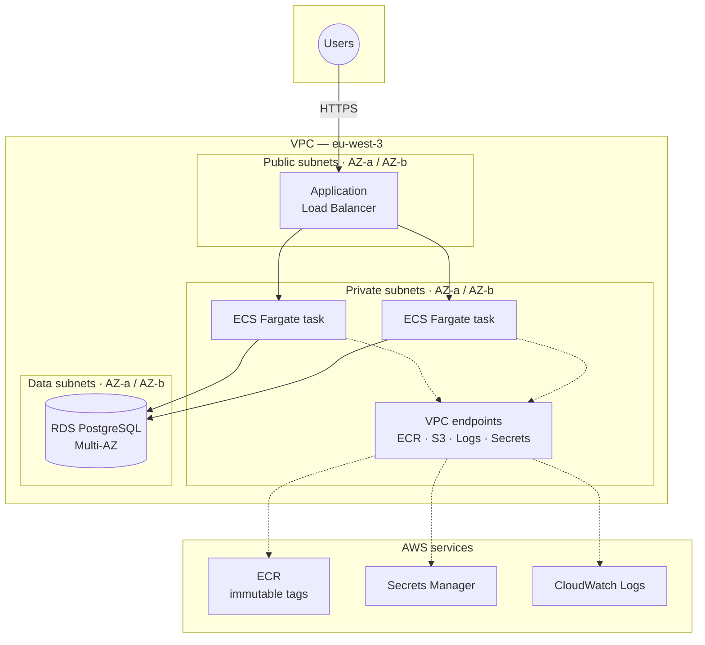

# terraform-aws-multienv

Multi-environment AWS infrastructure on ECS Fargate, written in modular Terraform
with isolated `dev` / `staging` / `prod` root configurations, plan-time tests and
a security-scanning CI pipeline.

[](https://github.com/aliiios/terraform-aws-multienv/actions/workflows/ci.yml)
[](https://www.terraform.io/)
[](https://www.checkov.io/)
[](./LICENSE)

> ### Deployment status
>
> The AWS account used to build and validate this infrastructure was
> **decommissioned after the demo period** to avoid ongoing cost. The codebase is
> complete and remains **fully validated on every commit** — formatting,
> `terraform validate`, tflint with the AWS ruleset, and Checkov security
> scanning all run in CI **without requiring a cloud account**.
>
> To deploy it into your own account, see **[SETUP.md](./SETUP.md)**.

---

## Table of contents

- [What this project is](#what-this-project-is)
- [Architecture](#architecture)
- [Repository layout](#repository-layout)
- [Design decisions](#design-decisions)
- [Security model](#security-model)
- [Quality gates](#quality-gates)
- [Testing](#testing)
- [Running the checks locally](#running-the-checks-locally)
- [Deploying](#deploying)
- [Cost](#cost)
- [What I would do next](#what-i-would-do-next)
- [Documentation index](#documentation-index)
- [License](#license)

---

## What this project is

A production-shaped AWS platform defined entirely as code. The goal was not to
deploy the largest possible architecture, but to build one the way a team would
build it: reusable modules, environments that cannot accidentally share state,
security scanning that blocks merges, tests that run before anything is created,
and decisions recorded in writing.

**Scope**

| Layer | What it does |
|---|---|
| Network | Three-tier VPC — public, private and data subnets across multiple Availability Zones |
| Compute | Containerised application on ECS Fargate behind an Application Load Balancer |
| Data | PostgreSQL on RDS, placed in the data subnets with no public route |
| Registry | ECR repository with immutable tags and lifecycle expiry |
| Secrets | Database credentials in AWS Secrets Manager, injected at task start — never in state or code |
| Connectivity | VPC endpoints for ECR, S3, CloudWatch Logs and Secrets Manager, so private tasks reach AWS services without a NAT gateway path |
| State | S3 backend with KMS encryption, versioning, and native S3 state locking |

**Deliberately out of scope:** a multi-account AWS Organization, IAM Identity
Center, Route 53 / ACM custom domains, and cross-region disaster recovery. Each
of these is discussed in [`architecture/`](./architecture) with the reasoning for
leaving it out.

---

## Architecture



**Traffic rules, enforced by security groups rather than by convention:**

- The ALB accepts traffic from the internet and is the only resource in a public subnet.
- ECS tasks accept traffic **only** from the ALB security group — not from a CIDR range.
- RDS accepts traffic **only** from the ECS task security group, on the database port.
- Nothing in the private or data tiers has a public IP or a route to an internet gateway.

Referencing security groups by ID instead of by CIDR means the rules stay correct
when subnets change, and they express intent that a reviewer can verify at a glance.

---

## Repository layout

```
.
├── app/                      Containerised application and its Dockerfile
├── architecture/             Architecture decision records (ADRs)
├── bootstrap/                One-time setup: S3 state bucket, KMS key, OIDC role
├── docs/                     Security model, cost analysis, operational runbook
├── environments/
│   ├── dev/                  Root module — dev
│   ├── staging/              Root module — staging
│   └── prod/                 Root module — prod
├── modules/
│   ├── vpc/                  Three-tier network, route tables, VPC endpoints
│   ├── ecr/                  Container registry, immutable tags, lifecycle policy
│   ├── ecs/                  Cluster, task definition, service, ALB, autoscaling
│   └── rds/                  PostgreSQL instance, subnet group, Secrets Manager
├── tests/                    Terraform test suite (plan-time assertions)
├── .github/workflows/ci.yml  Validation, linting and security scanning
├── .checkov.baseline         Acknowledged findings — new findings fail the build
├── .tflint.hcl               Linter configuration
├── .pre-commit-config.yaml   Local hooks mirroring CI
├── Makefile                  make ci — the same checks CI runs
├── CONTRIBUTING.md
├── SECURITY.md
└── SETUP.md                  How to deploy into your own account
```

---

## Design decisions

Each decision is recorded as an ADR in [`architecture/`](./architecture). The
summary:

| Decision | Choice | Why |
|---|---|---|
| Environment isolation | Separate root modules per environment | Terraform workspaces share one state file and one backend key. A blast radius that crosses environments is the single most common way IaC causes an outage. Separate roots make `prod` physically unreachable from a `dev` apply. |
| State locking | Native S3 locking (`use_lockfile = true`) | Terraform 1.11 made DynamoDB locking unnecessary. Removes an entire resource, its IAM policy and its cost from the design. |
| State encryption | Customer-managed KMS key | An AWS-managed key gives no control over the key policy. A CMK lets state access be audited and revoked independently of S3 permissions. |
| Image tags | Immutable ECR tags | A mutable `:latest` means the image you tested is not provably the image running. Immutability makes deployments reproducible and rollbacks honest. |
| Database credentials | Secrets Manager, injected as task secrets | A password passed as a Terraform variable ends up in plaintext in state. Injection at task start keeps it out of state, out of Git and out of the task definition. |
| AWS access from CI | GitHub OIDC, no static keys | Long-lived access keys in repository secrets are the most common cloud credential leak. OIDC issues short-lived credentials scoped to a single repository and branch. |
| Private egress | VPC endpoints instead of NAT gateway | A NAT gateway is roughly 32 EUR/month per AZ before data charges. Interface endpoints cover the four services the tasks actually need and keep the traffic on the AWS backbone. |
| Multi-account | Single account, tagged environments | An AWS Organization with account-per-environment is the correct production answer. It was out of scope here; the reasoning and the migration path are written up in the ADRs. |

---

## Security model

Full detail in [`docs/`](./docs) and [`SECURITY.md`](./SECURITY.md).

**Network**
- No resource outside the public subnets has a route to an internet gateway.
- Security group rules reference other security groups, never CIDR blocks, for internal traffic.
- Database subnets have no outbound internet route at all.

**Identity**
- CI authenticates through GitHub OIDC with a role restricted by `sub` claim to this repository.
- Task execution and task roles are separated: the execution role pulls images and writes logs, the task role holds only what the application itself needs.
- No IAM user, access key or secret key exists anywhere in this repository.

**Data**
- Terraform state: KMS-encrypted, versioned, public access blocked, TLS-only bucket policy.
- RDS: encryption at rest, automated backups, not publicly accessible.
- Secrets: stored in Secrets Manager, referenced by ARN, never rendered into state.

**Supply chain**
- Container images are pinned by digest-backed immutable tags.
- CI actions and the Checkov image are version-pinned; nothing tracks `@master`.
- Dependabot proposes action and base-image updates monthly.

**Static analysis**

Checkov runs on every push and pull request against a committed baseline. Findings
that existed when scanning was adopted are recorded in `.checkov.baseline` and are
visible to anyone reading the repository. **Any new finding fails the build.**
Run `make scan-all` to see every finding including baselined ones.

---

## Quality gates

Every push and pull request runs three jobs. None of them require AWS credentials.

| Job | Checks | Blocking |
|---|---|---|
| **Format & Validate** | `terraform fmt -check -recursive`, then `terraform init -backend=false` + `terraform validate` on every root module and every child module | Yes |
| **Lint** | `tflint` with the AWS ruleset across the whole repository | Yes |
| **Security Scan** | Checkov 3.3.16 (pinned image) against `.checkov.baseline` | Yes |

The `-backend=false` flag is what makes this work without an account: Terraform
initialises providers and validates configuration without ever contacting the S3
backend or any AWS API.

All three are required status checks on `main`.

---

## Testing

The suite in [`tests/`](./tests) uses Terraform's native test framework with
`mock_provider`, so assertions run at plan time against mocked AWS responses —
no account, no credentials, no resources created.

What it asserts:

- Private and data subnets have no route to an internet gateway.
- The RDS security group accepts ingress only from the ECS task security group.
- Storage encryption is enabled on RDS and on the state bucket.
- ECR tag immutability is on.
- The task definition references secrets by ARN and contains no literal credentials.
- Each environment produces the expected subnet count across Availability Zones.

```bash
terraform test
```

This is the part of the project I would point to first in a review. Catching a
public-subnet misconfiguration in a plan-time assertion costs seconds; catching it
after an apply costs an incident.

---

## Running the checks locally

No AWS account is needed for any of this.

**Prerequisites**

| Tool | Version |
|---|---|
| Terraform | 1.11.4 |
| tflint | 0.58.0 |
| Docker | any recent version — runs Checkov |
| pre-commit | 3.x |

**Setup**

```bash
git clone https://github.com/aliiios/terraform-aws-multienv.git
cd terraform-aws-multienv
pre-commit install
make help
```

**Run the full pipeline**

```bash
make ci
```

`make ci` runs the same four commands CI runs, in the same order. If it passes
locally, it passes on GitHub.

| Target | What it does |
|---|---|
| `make fmt` | Format all Terraform files in place |
| `make fmt-check` | Verify formatting without changing files |
| `make validate` | Init without backend and validate every root and module |
| `make lint` | Run tflint across the repository |
| `make scan` | Run Checkov against the baseline |
| `make scan-all` | Run Checkov with no baseline — shows every finding |
| `make baseline` | Regenerate `.checkov.baseline` |
| `make ci` | All blocking checks, in CI order |
| `make clean` | Remove local `.terraform` directories and lock files |

---

## Deploying

Full instructions are in **[SETUP.md](./SETUP.md)**. In outline:

1. Run `bootstrap/` once with local state to create the S3 state bucket, the KMS
   key and the GitHub OIDC role, then migrate bootstrap's own state into the bucket.
2. Set the repository variable `AWS_ENABLED=true` and the secret `AWS_ROLE_ARN`
   to the OIDC role created in step 1.
3. Apply a single environment: `terraform -chdir=environments/dev apply`.

All three environments are fully defined in code, but only one was ever applied —
a deliberate cost decision, documented in the cost analysis under [`docs/`](./docs).

---

## Cost

Detailed breakdown in [`docs/`](./docs). Approximate monthly cost for one
environment in `eu-west-3`, at the sizes defined in `environments/dev`:

| Component | Approx. EUR/month |
|---|---|
| ECS Fargate (2 tasks, 0.25 vCPU / 0.5 GB) | ~15 |
| Application Load Balancer | ~18 |
| RDS PostgreSQL (`db.t4g.micro`, single-AZ) | ~13 |
| VPC interface endpoints (4) | ~28 |
| S3 state, KMS, ECR, CloudWatch Logs | ~3 |
| **Total** | **~77** |

Two cost decisions worth noting: VPC endpoints replaced a NAT gateway, which
would have cost more for less isolation; and `prod` is defined but was never
applied, which is why the three environments differ in instance sizing rather
than in structure.

---

## What I would do next

Being explicit about the gaps is more useful than pretending there aren't any.

- **Multi-account.** An AWS Organization with one account per environment, and IAM Identity Center for human access. This is the correct production answer and the single biggest structural improvement available.
- **Custom domain and TLS.** Route 53 with an ACM certificate on the ALB; currently the load balancer is reached by its AWS-generated DNS name.
- **Observability.** CloudWatch alarms on ALB 5xx rate, ECS task health and RDS connections, wired to an SNS topic. Metrics are collected but nothing alerts on them.
- **Progressive delivery.** ECS blue/green deployments through CodeDeploy, so a bad task definition rolls back automatically instead of by hand.
- **Policy as code.** OPA/Conftest alongside Checkov, to enforce organisation-specific rules that a generic scanner does not know about — required tags, approved regions, permitted instance families.
- **Checkov baseline burn-down.** The baseline is a starting point, not a destination. Every finding in it should eventually be either fixed or replaced by an inline skip with a written justification.

---

## Documentation index

| Document | Contents |
|---|---|
| [SETUP.md](./SETUP.md) | Bootstrap and deployment instructions |
| [CONTRIBUTING.md](./CONTRIBUTING.md) | Development workflow, tooling, commit convention |
| [SECURITY.md](./SECURITY.md) | Security policy, automated controls, reporting |
| [`architecture/`](./architecture) | Architecture decision records |
| [`docs/`](./docs) | Security model, cost analysis, operational runbook |

---

## License

[MIT](./LICENSE)
